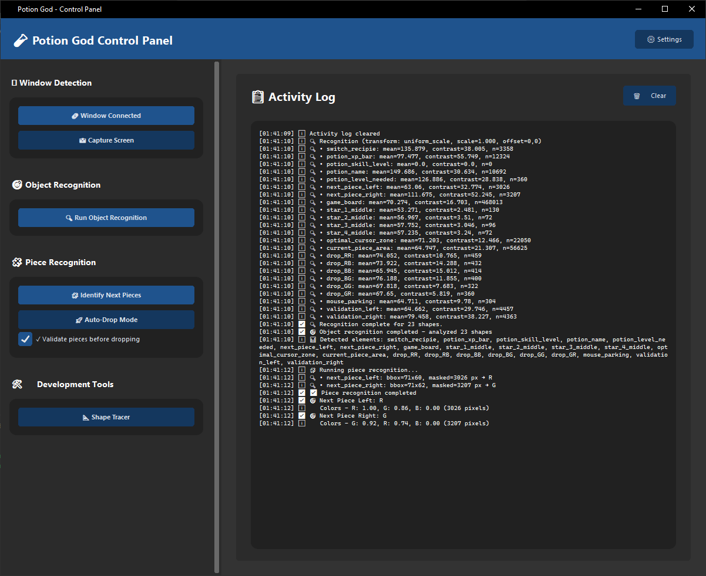
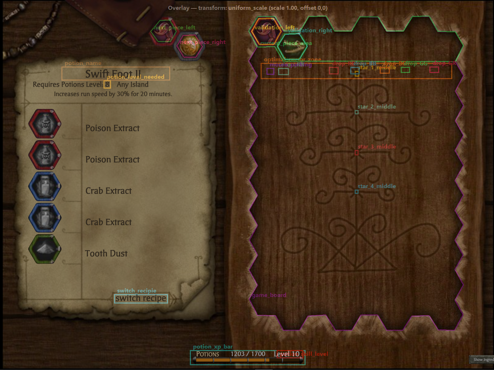

# 🧪 Potion God

## 📋 Overview

Potion God provides an intuitive interface for managing game autom- **⚠️ Warning** - Warnings and alerts (Orange)

- **❌ Error** - Errors and failures (Red)

## ⚙️ Settings

### Accessing Settings

Click the **⚙️ Settings** button in the main interface to open the settings window, which includes:

#### Advanced Settings - Timing Delays Configuration

The **Advanced** tab provides comprehensive control over automation timing:

- **📂 Load Config** - Load delays configuration from a JSON file
- **👁️ View & Edit** - Open the configuration editor to modify timing values
- **💾 Save Config** - Save current configuration to `configuration/delays.json`
- **🔄 Reset to Defaults** - Restore default timing values

#### Configurable Timing Parameters

**Key Polling**

- `enter_poll_ms` - How often to check for Enter/Esc key presses
- `enter_timeout_s` - Timeout for key press detection
- `loop_enter_timeout_s` - Timeout for loop key detection

**Mouse Movement & Clicks**

- `mouse_move_duration_ms` - Smooth mouse movement time
- `mouse_jitter_px` - Random pixel jitter for natural movement
- `pre_left_click_sleep_ms` - Pause before left clicking
- `left_click_hold_ms` - Duration to hold left mouse button
- `post_left_click_sleep_ms` - Pause after left clicking
- `pre_right_click_sleep_ms` - Pause before right clicking (piece rotation)
- `right_click_hold_ms` - Duration to hold right mouse button
- `flip_click_delay_ms` - Delay after piece rotation

**Automation Timing**

- `post_enter_settle_ms` - Wait time after initial Enter key
- `rescan_after_drop_delay_ms` - Pause between drops for game updates
- `auto_loop_interval_ms` - Time between automated drops (default: 2000ms)
- `post_drop_sleep_ms` - Brief pause after dropping pieces

**Validation & Error Handling**

- `validation_mouse_park_delay_ms` - Delay before piece validation
- `validation_initial_delay_ms` - Initial wait before validation attempts
- `validation_retry_delay_ms` - Delay between validation retries
- `validation_max_attempts` - Maximum validation attempts before failure

#### Pair-Specific Overrides

Advanced users can configure specific timing overrides for different piece combinations in the `pair_overrides` section.

### Configuration File Location

Settings are stored in: `configuration/delays.json`

🛠️ Developmentn features including:

- **Window Detection** - Locate and capture game windows
- **Asset Recognition** - Detect game board elements
- **Game Analysis** - Analyze current game state
- **Bot Control** - Auto Drop Potions in correct locations.

## ✨ Features

- **Real-time Logging** - Activity log with colored status messages and timestamps
- **Modular Controls** - Organized sections for different automation features
- **Status Indicators** - Visual feedback for all system states
- **Responsive Layout** - Adaptive UI that scales with window size

## � Screenshots

### Main Tool Interface



### Overlay Feature



## �🚀 Quick Start

### Prerequisites

- Python 3.7 or higher
- Windows OS (currently optimized for Windows)

### Installation

**Option 1: Download Executable (Recommended)**

1. **Download** the latest `PotionBot.exe` from the releases page
2. **Run** the executable directly - no installation required!
3. The executable is completely standalone and includes all dependencies

**Option 2: Install from Source**

1. **Clone or download** this repository
2. **Navigate** to the project directory:

   ```powershell
   cd PotionGod
   ```

3. **Create a virtual environment** (recommended):

   ```powershell
   python -m venv .venv
   .venv\Scripts\activate
   ```

4. **Install dependencies**:
   ```powershell
   pip install -r requirements.txt
   ```

### Building Executable (For Developers)

If you want to build your own executable from source:

1. **Follow the source installation** steps above
2. **Run the build script**:
   ```powershell
   build_spec.bat
   ```
3. **Find the executable** in the `dist` folder
4. See `BUILD.md` for detailed build instructions and configuration options

### Running the Application

**Option 1: Using the Executable (Easiest)**

Simply double-click `PotionBot.exe` - no additional setup required!

**Option 2: Using Python directly**

```powershell
python src\gui.py
```

**Option 3: Using the batch file**

```powershell
run.bat
```

**Option 4: Using the script from scripts folder**

```powershell
scripts\run_gui.bat
```

## 🎮 Usage

### Getting Started

1. **Launch** the application using one of the methods above
2. **Find Game Window** - Click to detect the target game window
3. **Object Recognition** - Load ROI boxes, right click for overlay
4. **Find Next Pair** - Run prior to auto-potion drop
5. **Auto Potion Drop** - Once pressed, place the first piece manaully then press enter to start

### Interface Overview

#### Main Panel

- **📋 Activity Log** - Real-time status updates and system messages
- **Clear Button** - Reset the activity log

### Status Messages

The activity log uses color-coded messages:

- **ℹ️ Info** - General information (Gray)
- **✅ Success** - Successful operations (Green)
- **⚠️ Warning** - Warnings and alerts (Orange)
- **❌ Error** - Errors and failures (Red)

## �🛠️ Development

### Customization

#### Colors

Modify the `COLORS` dictionary in `src/gui.py` to change the theme:

```python
COLORS = {
    "primary": "#1f538d",      # Main button color
    "secondary": "#14375e",    # Secondary elements
    "success": "#2FB36D",      # Success messages
    "error": "#E34F4F",        # Error messages
    "warning": "#F0A202",      # Warning messages
    # ... more colors
}
```

#### Fonts

Update the `FONTS` dictionary to change typography:

```python
FONTS = {
    "title": ("Segoe UI", 20, "bold"),
    "heading": ("Segoe UI", 14, "bold"),
    "body": ("Segoe UI", 11),
    # ... more font styles
}
```

## 🔧 Configuration

The application uses default settings optimized for most systems:

- **Window Size**: 1200x950 pixels
- **Theme**: Dark mode with blue accents
- **Font**: Segoe UI (Windows) with Cascadia Code for logs

## 🐛 Troubleshooting

### Common Issues

**"Module not found" errors**

- Ensure you've activated the virtual environment
- Install dependencies: `pip install -r requirements.txt`

**GUI not appearing**

- Check that you're running on a system with GUI support
- Ensure Python tkinter is properly installed

## 📄 License

This project is for educational and personal use. Please respect game terms of service and use responsibly.

---

**Made with ❤️. -DL**
